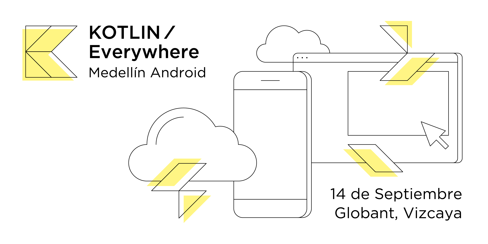

 

# Kotlin Everywhere 2019
Repo con los slides y links del Kotlin Everywhere Medellín

- Ana María Salazar - Comunidades en Tecnologia:
	- [Slides]() 
	- [Video](https://www.youtube.com/watch?v=3OXoqnB1hXc&t=7s) 

- Cristian Gomez - FP para no-Batos:
	- [Slides]() 
	- [Video](https://www.youtube.com/watch?v=Fy35l0ACD2Y)

- Leo Padhila - Backend sin sufrimiento:
	- [Slides]() 
	- [Video](https://www.youtube.com/watch?v=3RWwTWPjRrg) 

- Carlos Daniel Muñoz - Effective Kotlin Migration in Android:
	- [Slides](https://docs.google.com/presentation/d/14i_5Y2AkbHpZa8rQfB4tDwyCcse0nWgL7huTSOcd7gc/edit?usp=drivesdk)
	- [Video](https://www.youtube.com/watch?v=puQ0QOgEAh4)

- Alejandro Rios - DI: "Vaccinating" your projects 💉:
	- [Slides](https://docs.google.com/presentation/d/1bGfz8ly67E8FufCn1btlJlN_8KHt_JWNgKkxYRAs0u4/edit?usp=sharing) 
	- [Video](https://www.youtube.com/watch?v=DpKxz-_b2rg) 
	- [Code sample](https://github.com/alejandro-rios/Hello-DI) 

- Noe Branagan & Yury Camacho - Kotlin Multiplatform:
	- [Slides]()
	- [Video](https://www.youtube.com/watch?v=LneMhw-b7GU&t=165s)
	- [Code sample](https://github.com/camachoyury/KMultiWeather) 

- Romel Palomino - Desarrollo para Kotlin, sin pensar en java:
	- [Slides]()
	- [Video](https://www.youtube.com/watch?v=97z2PaH4qYE) 

- Alejandro Gomez - Java vs Kotlin (bytecode level):
	- [Slides]() 
	- [Video](https://www.youtube.com/watch?v=DSH51FLNObE) 
	
# Speakers

| [ <b>Ana Maria Salazar</b>]()  | [ <b>Cristian Gomez</b>](https://github.com/iyubinest)  | [ <b>Leo Padhila</b>](http://ldpadilha.com)  | [ <b>Carlos Daniel Muñoz</b>](https://github.com/cdmunoz)  |  [ <b>Alejandro Rios</b>](https://github.com/alejandro-rios)  |
|:-:|:-:|:-:|:-:|:--:|
| [ <b>Noe Branagan</b>](https://twitter.com/noebranagan)  | [ <b>Yury Camacho</b>](https://github.com/camachoyury)  | [ <b>Romel Palomino</b>](https://github.com/aldajo92)  | [ <b>Alejandro Gomez</b>](https://github.com/aldajo92)  |  |
